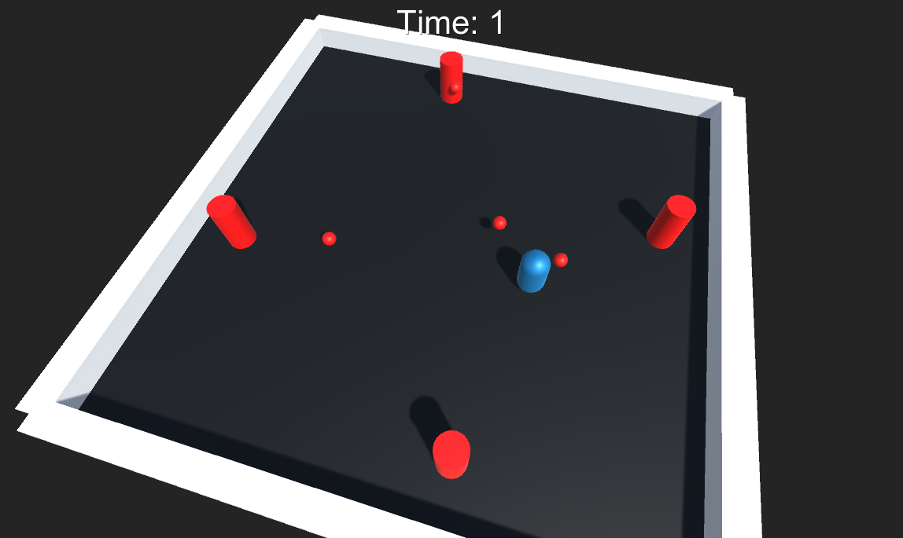
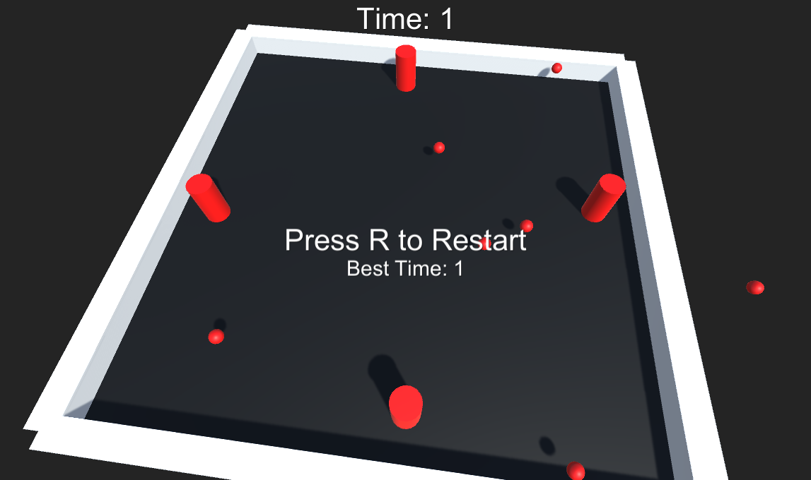

이 레포는 "레트로의 유니티 프로그래밍 에센스" 책의 예제입니다.  

이 예제는  
1. Game Manager
2. Level
3. Player
4. Bullet Spawner and bullet
5. UI
가 있습니다.  

게임 화면입니다.  
파란 캡슐은 플레이어로, 빨간 총알 생성기가 플레이어쪽으로 생성하는 총알을 피해야 합니다.  
  
  

게임오버 시 게임오버 화면과 최고 기록(초)가 표기됩니다.